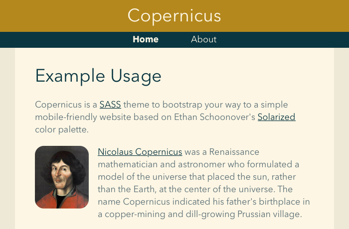

# Copernicus

Copernicus is a [SASS](http://sass-lang.com) theme to bootstrap your way to a simple mobile-friendly website.
Its design is inspired by Google's [Material Design](http://www.google.com/design/spec/material-design/introduction.html) and its colours by Ethan Schoonover's [Solarized](http://ethanschoonover.com/solarized) colour palette.

## Screenshots

## Usage

First, make sure your webpage follows the structure illustrated in `TEMPLATE.html`.
Compile the main stylesheet with `sass --load-path local main.scss` and add the resulting CSS to your project.

The colour scheme (among other things) can be customized in `local/_settings.scss`.
Any variables defined here will override the default options in `partials/_base.scss`.
Similarly, site-specific classes and styles can be appended to the main stylesheet by adding them to `local/_styles.scss`.
